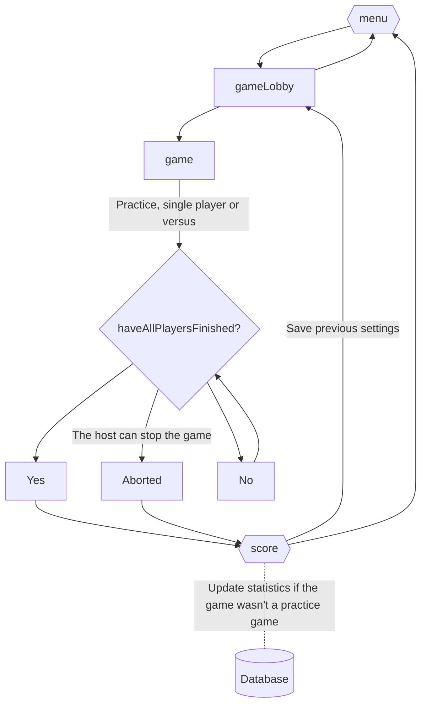

# :notebook: Notes

## :book: Game Rules

- A player scores by throwing the darts at the board
- Three darts per turn
  - Unless the game is won in fewer
- Darts that bounce or fall out cannot be thrown again and do not count
- Darts around the outer rim also do not count

### :dart: Scoring

- Maximum score 180
- _Bull_ is worth 50 points
- _Outer bull_ is worth 25 points
- Various numbers are worth their own value
  - Doubled when hitting the _outer rim_
  - 3x when hitting the _inner rim_

### :trophy: Winning

- To win a player must reach zero by hitting a _double_ or a _bull_
  - Score down from the 501 starting point = winning the _leg_
  - First to win three _legs_ wins the _set_
  - If a player scores more than their remaining points total their throw ends and is scored zero (for example 16 remaining and accidentally hit a 20 with a dart)

## :bulb: Ideas

- Practice Mode (This mode does not affect the statistics)
- Single player mode
- Versus Mode (2-8 players)
- Profile with statistics
  - Heatmap to visualize the thrown darts
  - Won _legs_, _sets_...
  - Percentage of hit areas (for example _bull_ or _outer rim_) on the board
- Individual game rules

## :repeat_one: App Flowcharts

**This chart shows the typical flow of a game in the app:**

